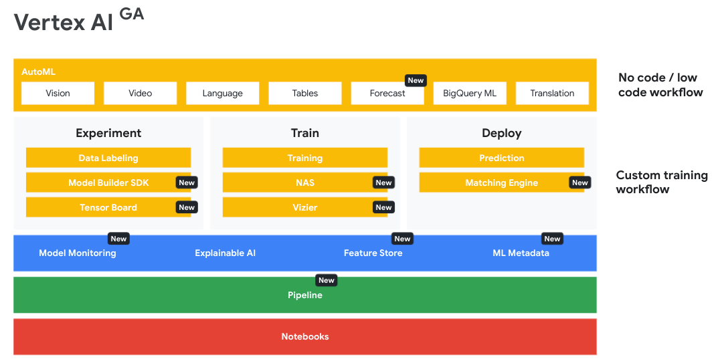

# Vertex AI: Qwik Start

In this lab, you will use [BigQuery](https://cloud.google.com/bigquery) for data processing and exploratory data analysis and the [Vertex AI](https://cloud.google.com/vertex-ai) platform to train and deploy a custom TensorFlow Regressor model to predict customer lifetime value (CLV). The goal of the lab is to introduce Vertex AI through a high value real world use case - predictive CLV. You will start with a local BigQuery and TensorFlow workflow you may already be familiar with and progress toward training and deploying your model in the cloud with Vertex AI as well as retrieving predictions and explanations from your model.



Vertex AI is Google Cloud's next generation, unified platform for machine learning development and the successor to AI Platform announced at Google I/O in May 2021. By developing machine learning solutions on Vertex AI, you can leverage the latest ML pre-built components and AutoML to significantly enhance development productivity, the ability to scale your workflow and decision making with your data, and accelerate time to value.

## Learning objectives

* Train a TensorFlow model locally in a hosted [**Vertex Notebook**](https://cloud.google.com/vertex-ai/docs/general/notebooks?hl=sv).
* Create a [**managed Tabular dataset**](https://cloud.google.com/vertex-ai/docs/training/using-managed-datasets?hl=sv) artifact for experiment tracking.
* Containerize your training code with [**Cloud Build**](https://cloud.google.com/build) and push it to [**Google Cloud Artifact Registry**](https://cloud.google.com/artifact-registry).
* Run a [**Vertex AI custom training job**](https://cloud.google.com/vertex-ai/docs/training/custom-training) with your custom model container.
* Use [**Vertex TensorBoard**](https://cloud.google.com/vertex-ai/docs/experiments/tensorboard-overview) to visualize model performance.
* Deploy your trained model to a [**Vertex Online Prediction Endpoint**](https://cloud.google.com/vertex-ai/docs/predictions/getting-predictions) for serving predictions.
* Request an online prediction and explanation and see the response.

## Setup

### 1. Enable Cloud Services utilized in the lab environment:

#### 1.1 Launch [Cloud Shell](https://cloud.google.com/shell/docs/launching-cloud-shell)

#### 1.2 Set your Project ID

Confirm that you see the desired project ID returned below:
```
gcloud config get-value project
```

If you do not see your desired project ID, set it as follows:
```
PROJECT_ID=[YOUR PROJECT ID]
gcloud config set project $PROJECT_ID
```

#### 1.3 Use `gcloud` to enable the services

```
gcloud services enable \
  compute.googleapis.com \
  iam.googleapis.com \
  iamcredentials.googleapis.com \
  monitoring.googleapis.com \
  logging.googleapis.com \
  notebooks.googleapis.com \
  aiplatform.googleapis.com \
  bigquery.googleapis.com \
  artifactregistry.googleapis.com \
  cloudbuild.googleapis.com \
  container.googleapis.com
```

### 2. Create Vertex AI custom service account for Vertex Tensorboard experiment tracking

#### 2.1. Create custom service account
```
SERVICE_ACCOUNT_ID=vertex-custom-training-sa
gcloud iam service-accounts create $SERVICE_ACCOUNT_ID  \
    --description="A custom service account for Vertex custom training with Tensorboard" \
    --display-name="Vertex AI Custom Training"
```

#### 2.2. Grant it access to GCS for writing and retrieving Tensorboard logs
```
PROJECT_ID=$(gcloud config get-value core/project)
gcloud projects add-iam-policy-binding $PROJECT_ID \
    --member=serviceAccount:$SERVICE_ACCOUNT_ID@$PROJECT_ID.iam.gserviceaccount.com \
    --role="roles/storage.admin"
```

#### 2.3. Grant it access to your BigQuery data source to read data into your TensorFlow model
```
gcloud projects add-iam-policy-binding $PROJECT_ID \
    --member=serviceAccount:$SERVICE_ACCOUNT_ID@$PROJECT_ID.iam.gserviceaccount.com \
    --role="roles/bigquery.admin"
```

#### 2.4. Grant it access to Vertex AI for running model training, deployment, and explanation jobs
```
gcloud projects add-iam-policy-binding $PROJECT_ID \
    --member=serviceAccount:$SERVICE_ACCOUNT_ID@$PROJECT_ID.iam.gserviceaccount.com \
    --role="roles/aiplatform.user"
```

### 3. Creating a Vertex Notebooks instance

An instance of **Vertex Notebooks** is used as a primary lab environment.

To provision the instance follow the [Create an new notebook instance](https://cloud.google.com/vertex-ai/docs/general/notebooks) setup guide. Use the *TensorFlow Enterprise 2.3* no-GPU image. Leave all other settings at their default values.

After the instance is created, you can connect to [JupyterLab](https://jupyter.org/) IDE by clicking the *OPEN JUPYTERLAB* link in the [Vertex AI Notebooks Console](https://console.cloud.google.com/vertex-ai/notebooks/instances).


### 4. Clone the lab repository

In your **JupyterLab** instance, open a terminal and clone this repository in the `home` folder.
```
cd
git clone https://github.com/GoogleCloudPlatform/training-data-analyst.git
```

### 5. Install the lab dependencies

Run the following in the **JupyterLab** terminal to go to the `training-data-analyst/self-paced-labs/vertex-ai/vertex-ai-qwikstart` folder, then pip install `requirements.txt` to install lab dependencies:

```bash
cd training-data-analyst/self-paced-labs/vertex-ai/vertex-ai-qwikstart
pip install -U -r requirements.txt
```

### 6. Navigate to lab notebook

In your **JupyterLab** instance, navigate to __training-data-analyst__ > __self-paced-labs__ > __vertex-ai__ > __vertex-ai-qwikstart__, and open __lab_exercise.ipynb__.

Open `lab_exercise.ipynb` to complete the lab. 

Happy coding!